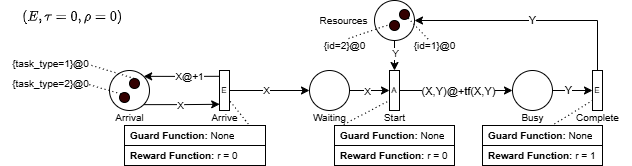
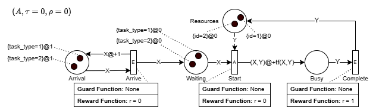
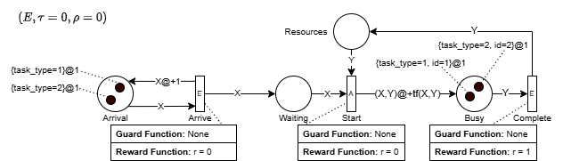
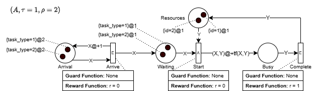
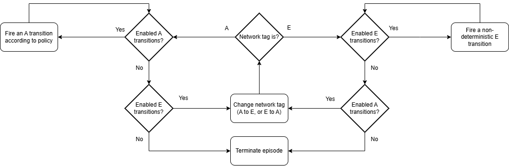
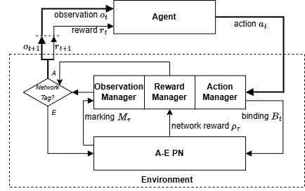

# A Gentle Introduction to Action-Evolution Petri Nets

## Introduction

Action-Evolution Petri Nets (A-E PNs) are an extension of Coloured Timed Petri Nets designed to express decision-making problems in a process-centric notation. The library `gympn` provides a framework for defining and simulating environments based on A-E PNs. For this reason, we provide an intuitive description of the framework and its concepts, making it easier for newcomers to understand how to use it effectively.

## Motivation

Petri Nets and their classical extensions are powerful tools for modeling concurrent systems, but they fall short when it comes to representing decision-making problems.
The reason for this is twofold:
1. **Non-deterministic Transitions**: Traditional Petri Nets transitions are non-deterministic, meaning that the combinations of tokens used to fire them (bindings) are chosen randomly when multiple options are available.
   This randomness is not suitable for decision-making tasks where specific actions need to be taken based on the current state of the system.
2. **Absence of Objective**: In a decision-making problem, the algorithm that takes decisions (the agent) needs a signal of goodness for the actions taken. 
   Classical Petri Nets do not provide a mechanism to evaluate the quality of actions, making them unsuitable to support decision-making algorithms.

To address these limitations, A-E PNs introduce two key features:
1. **Action Transitions**: These transitions allow for discrete actions to be taken based on the current state of the system, enabling deterministic decision-making. Actions are defined as the combination of tokens to be used to fire a given action transition.
   This means that the agent can choose which tokens to use based on the current state, rather than relying on random selection.
2. **Reward Signals**: A mechanism to evaluate the quality of actions taken, allowing the agent to learn from its experiences and improve its decision-making over time.

### Petri Nets Recap

A basic Petri Net consists of:
- **Places**: Represent states or conditions.
- **Transitions**: Represent events that may change the state.
- **Tokens**: Reside in places and represent the current state.
- **Arcs**: Connect places to transitions and vice versa.

The distribution of tokens across places represents the current state of the system, commonly called **marking**.
Transitions can **fire** when certain conditions (commonly called **guard functions**) are met. The firing of a transition consumes tokens from places connected to arcs incoming to the transition, and produces tokens in places connected to arcs outgoing from the transition.

Classic Petri Nets, however, do not allow representing tokens with different characteristics (colours) or time-dependent behaviour, which limits their applicability in complex systems. For this reason, several extensions have been proposed, such as Coloured Petri Nets (CPN) and Timed Petri Nets (TPN).
The combination of these two extensions leads to Coloured Timed Petri Nets (CTPN), which allow representing tokens with different characteristics and time-dependent behaviour. CTPNs are implemented in `simpn`, the core library on top of which `gympn` is built. Before introducing A-E PNs, it is important to have a basic understanding of CTPNs. To this end, let us consider the following example:

!images/ctpn_example.png

In this example, we have a simple CTPN with three places

### Action-Evolution Petri Nets

The previous example demonstrated the limitations of CTPNs when it comes to expressing decision-making problems. Let us rework the example using A-E PN.



The problem expressed through A-E PN presents the elements necessary to express a decision-making problem:
- **Transition Tags**: Every transition is tagged with either **E** (Evolution) or **A** (Action).
- **Network Tag**: The network marking includes a tag, either **E** or **A**, that determines what type of transition is enabled.
- **Transition Rewards**: Every transition is associated with a reward function that determines what transition type is enabled. In the example, a reward of 1 is generated every time a task is completed. Thus, the objective is to minimize the cycle time of tasks.
- **Network Reward**: The network marking includes the total reward collected until the current time.

These elements allow the modeler to express the available actions and when they are enabled, as well as the reward (the objective) to maximize.
In the initial marking reported in the example, only **E** transitions are enabled. This means that only the Arrive transition is allowed to fire consuming one of the tokens available in Arrival (in any order, since **E** transitions are non-deterministic).
After both the tokens are used to fire the Arrive transition, there are no other **E** transitions available to fire at time 0.
However, the **A** transition Start has enabling bindings at the current time, so the network tag becomes **A** without changing the clock value.
This determines the new situation below.



At this point, the agent is called to make a decision on what binding (the combination of the tokens present in Waiting and Resources) to use to fire the Start transition.
A good agent will choose the binding that maximizes the reward, which in this case is the binding that consumes the token having *task_type* 0 in Waiting and the token having *id* 0 in Resources, or the binding that consumes the token having *task_type* 1 in Waiting and the token having *id* 1 in Resources.
Let us assume that our agent takes these two actions in sequence, consuming the tokens in Waiting and Resources, and producing two token in Busy. At this point, no other actions are available, so the network tag changes to **E**, and the clock is incremented to reach 1 (the lowest value that enables an **E** transition). This leads to the marking below:



In the new marking, the Arrive transition is enabled again, and the agent can choose to fire it, consuming one of the tokens in Arrival and producing a token in Waiting. Concurrently, the Complete transition is enabled, which generates a reward of 1 every time it is fired. After firing the two transitions (in any order), the new marking is as follows:



The network reward is now 2, and the agent is called to make a new choice of binding to fire the Start transition. The process continues until the maximum length of the simulation is reached.
To summarize the working mechanism of A-E PNs in terms of network tag and clock, we can refer to the image below



### Implementation in gympn
Let us model the previous example using `gympn`. The first step is to define the A-E PN model, which can be done using the `GymProblem` class. The model is defined by specifying the places, transitions, arcs, and their properties, in the same fashion as one would do in `simpn`.

```python
from simpn.simulator import SimToken
from gympn.simulator import GymProblem

# Instantiate a simulation problem.
agency = GymProblem()

# Define cases
arrival = agency.add_var("arrival", var_attributes=['task_type'])
waiting = agency.add_var("waiting", var_attributes=['task_type'])
busy = agency.add_var("busy", var_attributes=['task_type', 'code_employee'])
arrival.put({'task_type': 0})
arrival.put({'task_type': 1})

# Define resources.
employee = agency.add_var("employee", var_attributes=['code_employee'])
employee.put({'code_employee': 0})
employee.put({'code_employee': 1})

# Define transitions
def arrive(a):
  return [SimToken(a, delay=1), SimToken(a)]
agency.add_event([arrival], [arrival, waiting], arrive)

def start(c, r):
  """"
  This function is called when a task is assigned to an employee.
  :param c: the task
  :param r: the resource
  :return: a list of SimTokens representing the task and the resource that were assigned to them
  """
  if c['task_type'] == r['code_employee']:
      return [SimToken((c, r), delay=1)]
  else:
      return [SimToken((c, r), delay=2)]


agency.add_action([waiting, employee], [busy], behavior=start, name="start")

def complete(b):
  """
  This function is called when a task is completed.
  It returns a list of SimTokens representing the task that was completed.
  :param b: the tuple (task, resource)
  :return: a list of SimTokens representing the resource that has completed a task
  """
  return [SimToken(b[1])]

agency.add_event([busy], [employee], complete, name='done', reward_function=lambda x: 1)
```

### Training a DRL Agent
The A-E PN framework was conceived to provide a process-centric approach to modeling and solving sequential decision-making problems. In particular, Deep Reinforcement Learning (DRL) was chosen as the main algorithm to train agents in A-E PN environments, as it allows for learning complex policies based on the state of the system (the marking of the A-E PN).
The interaction between DRL agent and A-E PN environment is presented graphically below:



To train a Deep Reinforcement Learning (DRL) agent on the defined A-E PN, we can use the `gympn` library's built-in support for RL algorithms. The following code snippet demonstrates how a single line of code is sufficient to train the Proximal Policy Optimization (PPO) agent.

```python
# Default training arguments (change them as needed)
default_args = {
  # Algorithm Parameters
  "algorithm": "ppo-clip",
  "gam": 1, # With finite horizon, it is better to use gam=1
  "lam": 0.99,
  "eps": 0.2,
  "c": 0.2,
  "ent_bonus": 0.0,
  "agent_seed": None,

  # Policy Model
  "policy_model": "gnn",
  "policy_kwargs": {"hidden_layers": [64]},
  "policy_lr": 3e-4,
  "policy_updates": 2,
  "policy_kld_limit": 0.01,
  "policy_weights": "",
  "policy_network": "",
  "score": False,
  "score_weight": 1e-3,

  # Value Model
  "value_model": "gnn",
  "value_kwargs": {"hidden_layers": [64]},
  "value_lr": 3e-4,
  "value_updates": 10,
  "value_weights": "",

  # Training Parameters
  "episodes": 10,
  "epochs": 100,
  "max_episode_length": None,
  "batch_size": 64,
  "sort_states": False,
  "use_gpu": False,
  "load_policy_network": False,
  "verbose": 0,

  # Saving Parameters
  "name": "run",
  "datetag": True,
  "logdir": "data/train",
  "save_freq": 1,
  "open_tensorboard": True, # Open TensorBoard during training (defaults to False)
}

agency.training_run(length=10, args_dict=default_args)
```

### Testing the Trained Agent

After training the agent, we can test its performance in the A-E PN environment. The following code snippet demonstrates how to run the trained agent and visualize its actions.

```python
from gympn.solvers import GymSolver

solver = GymSolver(weights_path='path_to_weights.pth', metadata=agency.make_metadata())
res = agency.testing_run(length=10, solver=solver)
print(res)
```

This code initializes a `GymSolver` object with the trained weights and metadata from the A-E PN environment, allowing the agent to interact with the environment and make decisions based on the learned policy.

### Conclusion
This short tutorial focused on the main concepts and constructs in `gympn` to model decision-making problems using Action-Evolution Petri Nets. More advanced features 