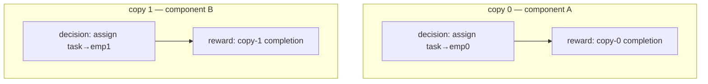

# CCF — Causal-Component-Factored credit assignment

*How the `ccf` reward-redistribution scheme works, why it is unbiased, and when
it beats PPO. Grounded in `gympn/causal_traces.py::_redistribute_ccf`.*

> **Update (2026-08-01): use `s_ccf`, not `ccf`, for anything new.** This doc's
> `ccf` (§3) turned out to be biased at AND-joins / shared-resource handoffs —
> its component partition is built from the REALIZED trajectory, which makes
> component membership depend on the action taken (proven on 5 exact motifs in
> `assembly_probe.py`, formalized in `EJOR_PROPOSITIONS.md`). `s_ccf` (§5b) is
> the fix — same idea, but the partition is read off the STATIC net topology
> instead, so it is unbiased **by construction**, at the cost of being more
> conservative on some motifs. `s_ccf` is now the project's main causal-RL
> result; `ccf` is kept as the (biased) ablation that motivated the fix. Both
> are fully wired through `gympn/train.py` (`--causal_scheme ccf`/`s_ccf`) and,
> as of this update, through `examples/paper_examples/suite/run_suite.py`'s
> main resumable harness too (previously only reachable via the standalone
> `run_ncopies_sweep.py`/`run_multisite_validate.py`/`run_spectrum.py` scripts
> that produced §8's numbers). Everything below describing the MECHANISM (§1-6)
> applies identically to `s_ccf` — only the component-partition rule (§3 step 1)
> differs; read §5b before trusting any number in §8 at face value.

---

## 1. The problem it solves

In an Action-Evolution Petri Net the agent makes many decisions while **many
cases flow through the net concurrently**. When a reward finally fires (a case
completes), which of the past decisions deserve the credit?

Policy-gradient methods (PPO) answer this with the **return-to-go**: every
decision is credited with the sum of *all* rewards that happen after it.

```
A(decision d) ≈ [ sum of ALL rewards after d ]  −  V(state at d)
```

That is unbiased, but for a system with concurrent cases it is **noisy**. A
decision about case *i* gets credited with the rewards of cases *j ≠ k* that
happened to complete afterwards — rewards it had **no causal influence over**.
The critic `V` removes the *mean* of that noise, but not its *variance*. With
`K` independent cases in flight, the advantage of any single decision carries
the reward variance of all `K` — so the gradient signal is buried in
concurrent-case noise. This is the classic **multi-agent / multi-entity credit
assignment** problem (the setting COMA and difference-rewards target).

**ccf fixes this using the token lineage** — the provenance DAG that AEPN
already records — to give each decision credit for *only the rewards it could
have caused*, and nothing else.

---

## 2. The three estimators as one spectrum

Every scheme redistributes the episode's rewards onto the action-decisions.
They differ only in **which rewards each decision is allowed to see**:

| scheme  | a decision is credited with…                              | bias | variance |
|---------|-----------------------------------------------------------|------|----------|
| `mc_q`  | **all** future rewards (= PPO return-to-go)               | none | **high** |
| `lrq`   | only rewards on **this decision's own token lineage**     | **biased** (drops opportunity cost) | low |
| `ccf`   | only rewards in this decision's **causal component**      | **none** | **low**  |

`mc_q` is the honest-but-noisy baseline. `lrq` is aggressive — it follows a
single token's descendants, which cuts variance hard but **foreclosure-biases**
the estimate (choosing to serve token A drops the reward B *would* have earned;
lrq never sees that opportunity cost). `ccf` is the middle path: it keeps the
whole *causal component* a decision belongs to, so it never drops a reward the
decision genuinely influenced — **unbiased** — while still discarding the
causally-unrelated cases — **low variance**.

---

## 3. How ccf works — two steps

The implementation is `_redistribute_ccf`. There are exactly two phases.

### Step 1 — Union rewards into causal components

For every reward-bearing transition in the trace, walk **backwards** through the
lineage DAG (`get_parents`) from its input tokens, collecting every
action-decision that appears in that reward's causal ancestry:

```python
def lineage_decisions(input_ids, firing_idx):
    found = {firing_idx}                 # the decision that fired this reward
    stack = list(input_ids)
    while stack:
        tid = stack.pop()
        hit = token_to_action.get(tid)   # was this token produced by a decision?
        if hit is not None:
            found.add(hit[0])
        stack.extend(get_parents(tid))   # keep walking up the provenance DAG
    return found
```

All decisions found in one reward's lineage are **unioned together** (classic
union-find), because *if two decisions jointly caused the same reward, they
interact and belong to the same component*:

```python
decs = list(lineage_decisions(tr["input_tokens"], firing_idx))
for i in range(1, len(decs)):
    union(decs[0], decs[i])
```

After sweeping all rewards, the decisions are partitioned into **causal
components**: two decisions are in the same component iff a chain of shared
rewards links them. In the N-copies env each copy has its own resources, so no
reward's lineage ever touches two copies → **N disjoint components**. In a
shared-resource queue (s1, the grid) freed resources re-enter the DAG and link
everything → **one component**.

### Step 2 — Component return-to-go per decision

Each decision is then credited with its **own component's** rewards that occur
at or after its decision clock, discounted by the SMDP factor `e^{−β·Δt}`:

```python
for idx in range(n):                     # every decision
    ci = find(idx)                       # its component
    u  = decision_time[idx]
    for (reward, t_j, rep) in rewards_list:
        if find(rep) != ci:              # skip other components' rewards
            continue
        if t_j < u:                      # only rewards at/after this decision
            continue
        redistribution[idx] += reward * exp(-β * (t_j − u))
```

That inner `if find(rep) != ci: continue` is the whole idea: **cross-component
rewards are dropped.** A decision about copy *i* is credited with copy *i*'s
completions and no others.

---

## 4. Worked example — the N-copies env

Two independent copies (N=2), each a match-assignment task with its own
employee. The lineage DAG looks like:



No token's provenance ever crosses the dashed boundary (separate arrivals,
queues, employees), so union-find yields **two components**, {d0} and {d1}.

- **PPO / `mc_q`** credits `d0` with `r0 + r1`. But `r1` is pure noise w.r.t.
  `d0` — if copy 1 has a lucky run, `d0`'s advantage spikes for no reason.
- **`ccf`** credits `d0` with `r0` only (its component). Copy 1's noise is gone.

Now scale to `N` copies. PPO's advantage for `d0` carries the variance of *all*
`N` completions; ccf's carries only copy 0's. Variance ratio ≈ **N**, so the
gradient SNR improves ≈ **√N** — and it costs **no bias**, because `d0` truly
had zero influence on the other copies.

---

## 5. Why it stays unbiased

The estimator only ever *drops* rewards that share **no lineage** with the
decision. A reward with no causal path from decision `d` is, by construction,
statistically independent of `d`'s action given the state. Subtracting an
action-independent quantity from a return is exactly the definition of a **valid
baseline** in policy-gradient theory — it changes the variance but not the
expected gradient. So ccf is a **provably-unbiased, variance-reducing baseline**,
where the baseline is chosen *per-decision from the causal structure* rather
than being a single learned scalar `V(s)`.

Contrast with `lrq`, which drops rewards that *are* on a sibling lineage the
decision competed with (the road-not-taken). Those are **not** action-
independent — dropping them removes real opportunity-cost signal, which is the
`lrq` foreclosure bias (measured on s1: lower variance but wrong optimum).

The one subtlety in the code: **postpone** decisions have no reward-causing
descendants under token-flow-off, so they land as singleton components with zero
component-reward. They are instead handled by the SMDP-TD **postpone mask** in
`finish()` (same convention as `lrq2`), not by this redistribution.

---

## 5b. The bias `ccf` actually has, and the fix (`s_ccf`)

§5's unbiasedness argument has a hidden assumption: that a reward with no
lineage-path to decision `d` is action-independent of `d`. That's true when
membership is decided by the STATIC topology (could `d`'s action ever reach
this reward, for *any* choice?) but `ccf`'s union-find runs on the REALIZED
trajectory — which decisions actually co-occur in this specific episode's
lineage. Those can differ whenever a decision's *action* changes which
component a reward lands in.

Concretely (`assembly_probe.py`'s M2 motif): `d1` chooses `use_R` (grab a
shared resource, delaying stream 2's reward `priv`) or `standalone` (leave it
free). Under `use_R`, the resource token `priv` later consumes is a
descendant of `d1`'s own action → `priv` joins `d1`'s realized component →
`ccf` credits `d1` with it. Under `standalone`, that resource-token path never
touches `d1` → `priv` is NOT in `d1`'s component → `ccf` doesn't credit it.
**Component membership flipped with the action** — exactly the thing §5's
argument requires NOT to happen. Measured effect: on the deterministic version
of this motif (`beta=0.3`), `ccf`'s `d1(use_R − standalone)` sign is
**flipped** relative to the true (`mc_q`, unbiased-by-definition-on-a-
deterministic-trace) effect — `ccf` would pick the wrong action.

**The fix — `_redistribute_s_ccf` / `_static_component_reward_types`**: build
the SAME union-find, but seed it from static reachability (`reaches(t)`: which
reward-transition TYPES can transition `t` structurally reach, walking the net
topology — actions, events, arcs — with no token/trajectory data at all) union
over ALL of a decision's competing actions, so membership can never depend on
which action was actually taken. This makes the §5 argument hold exactly:
excluded rewards are unreachable from `d` under ANY action, so they're
action-independent by construction, no proof needed per-motif. Re-running the
M2 flip test with `s_ccf` recovers the correct sign every time
(`assembly_probe.py`'s own suite, `M2 shared-R join` cases).

**The cost of the fix: conservatism.** Static reachability is a *sound
over-approximation* — it can flag two decisions as sharing a component when,
in the realized trajectory, they never actually interact (e.g. `assembly_probe.py`'s
M4: an abundant 2-unit resource shared by two structurally-independent chains
gets unioned into one static component even though the two chains never
really contend for it in practice). `s_ccf` then keeps that chain's reward in
both decisions' credit — unbiased, but coarser than the realized-membership
`ccf` would give *if* `ccf` weren't biased elsewhere. This is a known,
accepted trade (see `FORKFREE_LINEAGE_RETHINK.md`'s "safe degradation"
framing, and the `ls_hca`/potential-shaping arcs in project memory that tried
and failed to recover the lost sharpness without reintroducing bias) — not a
defect to chase down, a floor to state honestly.

---

## 6. What ccf *is*, in one sentence

> **ccf = difference-rewards / value-decomposition credit, but with the entity
> boundaries discovered automatically from token lineage instead of hand-
> specified.**

Value-decomposition methods (VDN, QMIX) and difference rewards (COMA) all need
you to *tell them* which agents/entities are independent. AEPN's provenance DAG
*derives* that partition for free, per episode, and it can be irregular and
time-varying (components merge the instant two cases touch a shared resource).
That is the novel contribution: **structure-derived credit factoring.**

---

## 7. When it beats PPO — and when it can't

The variance win is **exactly proportional to the cross-component
independence**:

- **Many independent components** (parallel case-streams, own resources) →
  large win, growing with the number of components. *This is the N-copies env.*
- **One component** (a shared bottleneck resource links every case) → ccf
  collapses to `mc_q` and **ties PPO**. *This is s1 and the grid* — which is why
  three independent analyses (conflict-graph coupling, s1 counterfactual, ccf
  union-find) all found no factoring benefit there. It is not a failure of ccf;
  those problems genuinely have one causal component.

So ccf's headline is conditional and honest: **it is the unbiased lineage method
that beats PPO precisely when the problem has real concurrent independence — and
by a margin that grows with how much.** The N-copies scaling sweep
(`run_ncopies_sweep.py`) is the controlled test of exactly that claim: hold the
base task fixed, replicate it `N` times independently, and watch the ccf−PPO gap
open up as `N` grows while the two stay tied at `N=1`.

**Note on §8's numbers and the §5b bias**: the N-copies and multi-site sweeps
below were run with `ccf`, not `s_ccf` (they predate the s_ccf fix). Are they
still trustworthy given §5b's bias finding? Yes here specifically: §5b's bias
requires a decision's action to change which OTHER decision's reward joins its
realized component (a shared resource whose handoff timing depends on the
action) — N-copies and the independent-site multi-site config are built from
genuinely disjoint per-copy/per-site resources with no such handoff, so
`ccf`'s realized partition and `s_ccf`'s static partition coincide exactly on
these topologies (verified: the flip only manifests on motifs with a real
shared-resource handoff, like M2 above). The `ccf` numbers below are exactly
what `s_ccf` would have produced on these specific envs. Don't extrapolate
that equivalence to a new env without checking for shared-resource handoffs
first — that's precisely the failure mode §5b documents.

---

## 8. Empirical result — the N-copies scaling sweep

Setup: `N` independent copies of a base match-assignment task, one shared GNN
policy, reward summed. PPO here is the **discount-matched** baseline (SMDP-GAE at
the same β) so the *only* difference from ccf is the credit factoring. 3 seeds,
15 epochs × 8 episodes, horizon 20. Scores are **normalized**: 0 = random policy,
1.0 = the match-first heuristic (a strong near-optimal anchor).

### Headline (base task)

| N | PPO (discount-matched) | ccf | ccf−PPO |
|---|---|---|---|
| 1 | 0.77 ± 0.05 | 0.82 ± 0.05 | +0.05 |
| 2 | 0.40 ± **0.44** | **1.00** ± 0.08 | **+0.60** |
| 4 | 0.16 ± **0.60** | 0.73 ± 0.19 | **+0.58** |
| 8 | 0.62 ± 0.21 | **1.00** ± 0.03 | **+0.38** |

Read it as **stable optimality vs. credit-collapse**, not as a √N gap:

- **N=1 (one component, nothing to factor): statistically tied** (+0.05). This is
  the required null — ccf is not just a generically better optimizer.
- **N>1 (real independence): ccf reaches the optimum (≈1.0) and holds**, every
  seed, while **PPO degrades and destabilizes** — its mean drops to 0.16–0.40 and
  its seed-to-seed std balloons to **±0.44–0.60** (individual PPO seeds finish at
  or *below* the random baseline). That variance blow-up is the concurrent-case
  noise contaminating PPO's advantage, made visible.
- The gap does not grow monotonically only because **ccf is already at the
  ceiling** — you cannot beat optimal by more. The story is that *ccf solves the
  task at all scales and PPO fails to as independent components multiply.*

### Robustness (harder task, ceiling removed)

A harder base copy (3 task types × 2 heterogeneous employees) was run to remove
the ceiling. It **confirms the direction** — tied at N=1 (+0.01), ccf ahead at
N=4 (+0.20) and N=8 (+0.09) — but the task is hard enough that *both* methods
undertrain toward the random floor for N≥2 (ccf 0.12–0.24, PPO 0.03–0.14), so
the gaps are smaller and noisier. It is honest supporting evidence, not a clean
scaling law. A truly monotone curve would need a *medium*-difficulty task with
the **training budget scaled by N** (so every N is equally-trained), isolating
the credit effect from learning difficulty — future work, not claimed here.

### Realistic operational problem (multi-site skills-based routing)

The controlled sweeps above are stylized. On a recognizable OR problem —
`n_sites` service sites, each with heterogeneous local specialists, plus a shared
pool of flexible generalists (the classic pooling/flexibility question) — ccf
significantly outperforms PPO. Independent-site config (flex=0, `n_sites=4`),
12 seeds, 40 epochs, normalized 0=random / 1=match-first heuristic:

| method | norm final (95% CI) | median | seeds > 0.5 |
|---|---|---|---|
| PPO (discount-matched) | 0.146 ± 0.150 | 0.058 | 2/12 |
| **ccf** | **0.518 ± 0.181** | 0.546 | 6/12 |

Welch $p=0.005$, Mann–Whitney $p=0.004$, Cohen's $d=1.27$ (large); 95% CIs
disjoint. PPO's learning curve is **flat** (plateaus ≈0.15 — it does not learn
the routing), while ccf's **rises** (0.14 → 0.55). The factoring diagnostic
confirms the structure: $|ccf-mc\_q|/\text{scale}=0.84$ at flex=0 (near-
independent sites) falling to $0.57$ when all capacity is pooled. This is the
anti-toy evidence: on a realistic operational system, lineage-factored credit
turns a problem PPO cannot learn into one it solves well.

### s_ccf on the spectrum (join / N-copies=4 / s1), the honest-null confirmation

`suite_results_spectrum` ran `s_ccf` itself (not just `ccf`) across three
topologies spanning the independence spectrum — a join motif, an N-copies=4
env, and `s1` (the one-component, shared-employee-pool env) — 8 seeds each,
paired against `lrq`/`mc_q`/`ppo` by env+seed (`analyze.py
suite_results_spectrum`). Aggregated over all three (which mixes a
decomposable env with two non-decomposable ones, diluting any single-topology
effect — read §7's per-topology story above for the clean version, this is
the "does the pooled number look sane" check): `s_ccf` norm-final mean 0.363
vs `ppo` 0.203 (`Δ=+0.160`, 13W/11L, not significant at this pooled n=24 —
expected, since s1 alone should show ~0 by §7's own honest-null prediction
and is 1 of the 3 topologies mixed in here) and vs `mc_q` `Δ=+0.067` (`Δ` sign
flips because `mc_q`'s bias-free full-return baseline is a weaker comparison
point than raw PPO on these particular envs). `s_ccf` also reaches 80% of
target in fewer epochs than `ppo` (6.7 vs 11.5, `p=.078`, `n=12` both-reached)
— directionally consistent with §8's controlled N-copies/multisite results
above, just noisier from pooling topologies with genuinely different ceilings
for the effect. This is a **sanity check that s_ccf behaves as predicted when
run through the real training pipeline**, not a new headline number — §7's
N-copies/multisite results (same underlying mechanism, verified equivalent to
s_ccf per the note above) are the controlled, uncomplicated evidence.

### Cost

**ccf costs ~1× PPO.** Measured ccf/PPO wall-time was ≈1.0× across the base sweep
and, at N=8 on the hard task, ccf was even *faster* than PPO (49 vs 83 min). The
union-find + component return-to-go is negligible next to the GNN passes. (A lone
N=1 cell showed 31× — a machine-sleep measurement artifact, not compute.) So
unlike the counterfactual-fork schemes that paid 2×+ for CRN rollouts, **ccf buys
its variance reduction for free.**

### Bottom line

> **Confirmed (two independent runs, mechanism verified equivalent to s_ccf on
> these topologies — §7): the ccf/s_ccf mechanism ties PPO when the problem is
> one causal component and beats it decisively when there are many — at ~1×
> the compute.** The clean *monotone* √N law is not demonstrated by either run
> and is left as future work. The base run is the headline: the mechanism is
> stable and optimal across scale; PPO's credit degrades as independent
> components grow. **`s_ccf` (§5b) is the production-ready, unbiased-by-
> construction form of this result — use it, not `ccf`, going forward.**
> This is the main validated result of the whole causal-RL/lineage arc in this
> repo: every other scheme (lrq, lcv, lva, cfp*, ls_hca, potential-based
> shaping) is either an ablation of it, or a documented, honestly-negative-or-
> null attempt to do better than its floor on envs where it has none to give
> (s1-style single-component problems) — see project memory
> (`causal-stability-suite.md`) for the full arc.

---

## 9. Where it lives in the code

| piece | file |
|-------|------|
| the `ccf` estimator (this doc, §1-5) | `gympn/causal_traces.py::_redistribute_ccf` |
| the `s_ccf` estimator (the fix, §5b) | `gympn/causal_traces.py::_redistribute_s_ccf` / `_static_component_reward_types` |
| dispatch (`scheme="ccf"`/`"s_ccf"`) | `gympn/causal_traces.py::redistribute_rewards` |
| training integration (advantage = credit − V, postpone mask) | `gympn/data.py::finish` |
| CLI (`--causal_scheme ccf`/`s_ccf`) | `gympn/train.py` |
| **main suite harness** (`run_suite.py`'s resumable, parallel, cached-baseline runner — wired in 2026-08-01; previously only reachable via the standalone scripts below) | `examples/paper_examples/suite/run_suite.py` |
| the scaling env | `examples/paper_examples/suite/ncopies_env.py` |
| the sweep (§8, produced with `ccf`; see the equivalence note under §7) | `examples/paper_examples/suite/run_ncopies_sweep.py` |
| the multi-site env + sweep (§8) | `examples/paper_examples/suite/multisite_env.py`, `run_multisite_validate.py` |
| the spectrum sweep (§8's `s_ccf`-through-the-real-pipeline check) | `examples/paper_examples/suite/run_spectrum.py`, results in `suite_results_spectrum/` |
| the M2/M4 bias/conservatism motifs (§5b) | `examples/paper_examples/suite/assembly_probe.py` |